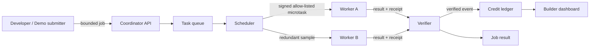

# Architecture

## Build Week architecture



## Components

### Coordinator API

- Accepts one or two supported job types.
- Validates payload size and schema.
- Decomposes a job into bounded tasks.
- Tracks job and task state.
- Returns the aggregated result.

### Scheduler

- Matches task requirements with registered worker capabilities.
- Respects Builder contribution policies.
- Leases tasks with expiration and retry.
- Sends a percentage of work to two nodes for verification.

### Worker

- Registers coarse capabilities and health.
- Evaluates Smart Contribution conditions.
- Downloads a signed, versioned task package from an allow-list.
- Executes within explicit time and resource limits.
- Returns result, timing, task version, and receipt hash.
- Never accepts arbitrary shell commands or general code from the coordinator.

### Verifier

- Applies task-specific validation.
- Compares redundant results where configured.
- Marks work verified, rejected, or requiring review.
- Emits the only event allowed to create credits.

### Credit ledger

- Uses append-only entries for the prototype.
- Connects every credit grant to a verified task receipt.
- Stores prototype balances only; no payment or redemption integration.

### Builder dashboard

- Shows worker state, task progress, resource telemetry, receipts, and prototype balance.
- Offers an immediate pause control.
- Clearly distinguishes current functionality from future services.

## Suggested implementation stack

The final stack should optimize for a one-week reliable demo:

- **Web/dashboard:** React + TypeScript.
- **Coordinator:** FastAPI or a similarly small typed API.
- **Worker:** Python for prototype speed; Rust or Go can be evaluated after the protocol stabilizes.
- **State:** SQLite or PostgreSQL, depending on deployment constraints.
- **Queue:** In-process/DB-backed for the MVP; Redis only if it removes more risk than it adds.
- **Packaging:** Docker for coordinator services; a simple local launcher for workers.
- **Telemetry:** Structured events and a small metrics view.

The architecture does not require a blockchain.

## Task contract

```json
{
  "task_id": "task_123",
  "job_id": "job_456",
  "task_type": "embedding_batch_v1",
  "package_digest": "sha256:...",
  "input_ref": "signed-or-local-demo-reference",
  "limits": {
    "timeout_seconds": 60,
    "memory_mb": 512,
    "cpu_percent": 25
  },
  "lease_expires_at": "2026-07-18T20:00:00Z",
  "signature": "..."
}
```

For Build Week, signing may be represented by a local coordinator key, but verification must be implemented if the demo claims signed tasks.

## State model

```text
Job:     queued → decomposed → running → verifying → completed | failed
Task:    queued → leased → running → submitted → verified | rejected | expired
Worker:  offline → available → working → paused
Credit:  pending → granted | denied
```

## Security boundaries

### Trusted for the MVP

- Coordinator configuration and allow-list.
- The demo task package published with the project.
- Synthetic/public demo data.

### Untrusted even in the MVP

- Worker-reported capabilities and timing.
- Worker results until verified.
- Network transport.
- Any task payload not validated against the contract.

## Privacy and security rules

- TLS for network transport in a deployed demo.
- No secrets inside task payloads.
- No personal, medical, financial, or proprietary data in the demo.
- Minimal logs and short retention.
- Explicit task types and payload limits.
- No arbitrary remote code execution.
- Dependency and package digests pinned.
- Redundant sampling and deterministic checks for the demo workload.
- Builder can inspect task name, version, limits, and receipt.

## Verification strategy

Choose a demo task that is deterministic or strongly checkable. Candidate tasks include hashing/chunk validation, public-text embeddings with known model/version, image transformations with deterministic checksums, or batch classification using a fixed model and test vectors.

The final task should demonstrate genuine AI relevance without making correctness impossible to verify in one week.

## What this architecture does not solve

- Frontier-model training across consumer networks.
- Privacy for arbitrary plaintext inference.
- Byzantine fault tolerance at global scale.
- Production isolation on every operating system.
- Sustainable credit redemption economics.
- Mobile platform background-compute restrictions.
- Legal and data-residency coverage across jurisdictions.

